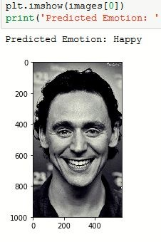
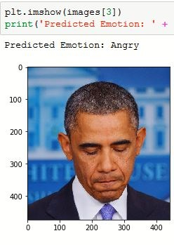

[](http://hits.dwyl.io/susantabiswas/facial-emotion-analyzer)
# Realtime Emotion Analysis from facial Expressions
Realtime Human Emotion Analysis From facial expressions. It uses a deep Convolutional Neural Network.
The model used achieved an accuracy of 63% on the test data. The realtime analyzer assigns a suitable emoji for the current emotion.

Model implementation was done in keras.<br>

## Some predicted outputs:




### Emojis used:
		&nbsp;&nbsp;&nbsp;&nbsp;&nbsp;&nbsp;      &nbsp;&nbsp;&nbsp;&nbsp;&nbsp;&nbsp;      &nbsp;&nbsp;&nbsp;&nbsp;&nbsp;&nbsp;      &nbsp;&nbsp;&nbsp;&nbsp;&nbsp;&nbsp;      &nbsp;&nbsp;&nbsp;&nbsp;&nbsp;&nbsp;      &nbsp;&nbsp;&nbsp;&nbsp;&nbsp;&nbsp;

### Snapshot from Realtime emotion Analyzer
The model prediction for the given frame was **Neutral** which is evident from the picture.<br>


## <u>Model Architecture

  
## <u>List of files
`facial Emotions.ipynb` : 
Jupyter notebook with well documented code explaining model preparation from start to training. Can be used for retraining the model.

  
## How to run
Realtime emotion detection, for this run:<br>
```python video_main.py```<br>


## Credits
- Dataset used was from Kaggle fer2013 Challenge [Challenges in Representation Learning: Facial Expression Recognition Challenge](https://www.kaggle.com/c/challenges-in-representation-learning-facial-expression-recognition-challenge/data)
- Emojis used were from https://emojiisland.com/
