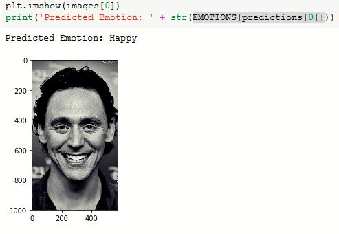
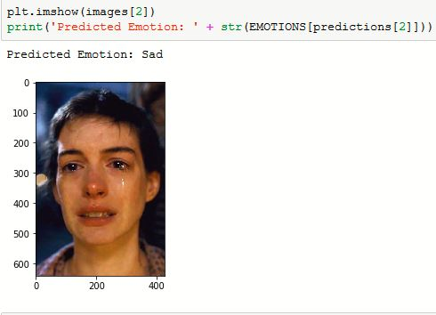

# Realtime Emotion Analysis from facial Expressions
Realtime Human Emotion Analysis From facial expressions. It uses a deep Convolutional Neural Network.
The model used achieved an accuracy of 63% on the test data.
Model implementation was done in keras.<br>

## Some prediction outputs:



## <u>Model Architecture

  
## <u>List of files
`facial Emotions.ipynb` : 
Jupyter notebook with well documented code explaining model preparation from start to training. Can be used for retraining the model.
<br> `main.py` : main python 
<br> `webcam_utils` :
Code for realtime emotion detection from face
<br> `prediction_utils` :
Code for doing prediction on image saved on disk
<br> `data_prep` :
Code for preparing dataset for training
<br> `preprocess.py` :
Code for saving images from csv file
<br>
  
## How to run
There are two options:
1. Realtime emotion detection, for this run:<br>
```python main.py emo_realtime```<br>
2. Emotion detection using image path, for this run:<br>
```python main.py emo_path --path <image path>```
  <br>e.g: ```python main.py emo_path --path saved_images/2.jpg```
  <br><br>If you don't want to specify path then just save the image as **"1.jpg"** inside **saved_images** folder<br> and run:
  ```python main.py emo_path```

## Credits
- Dataset used was from [Challenges in Representation Learning: Facial Expression Recognition Challenge](https://www.kaggle.com/c/challenges-in-representation-learning-facial-expression-recognition-challenge/data)
- Emojis used were from https://emojiisland.com/
